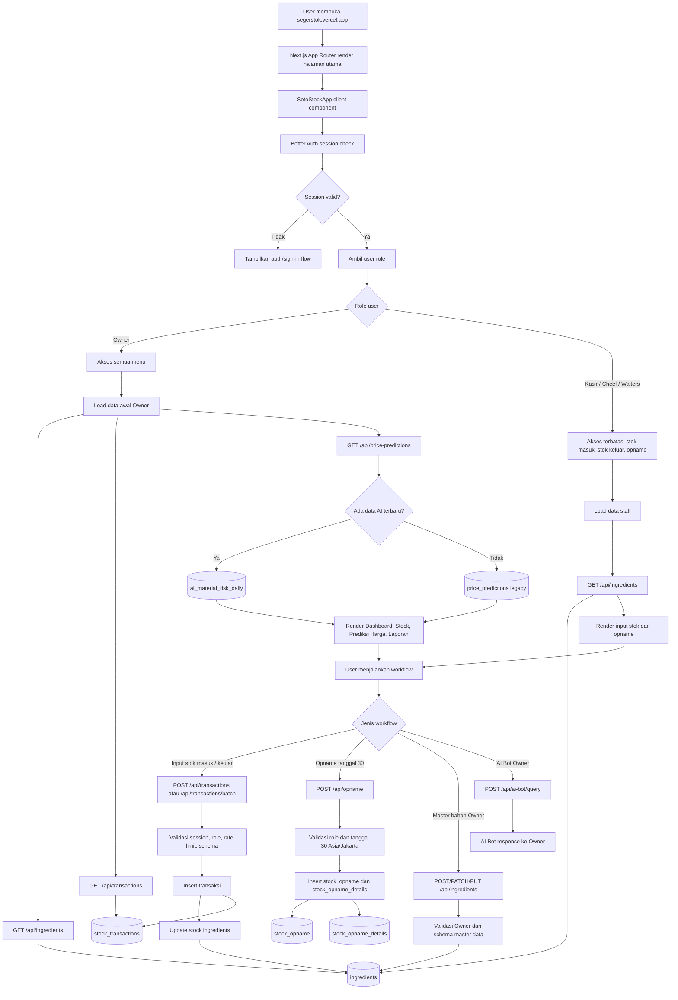
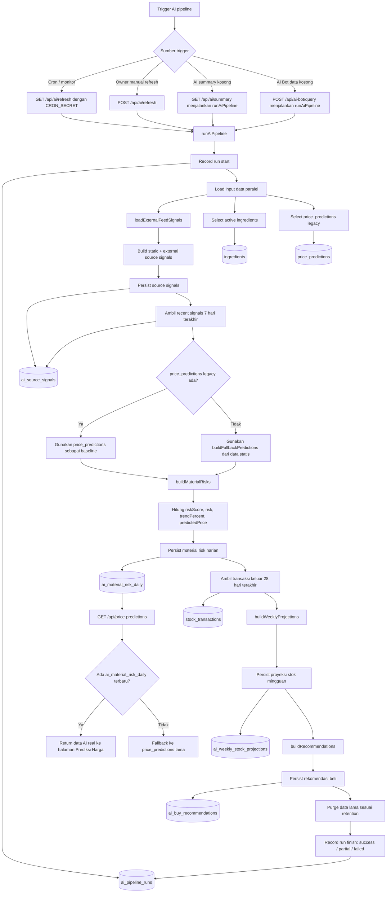
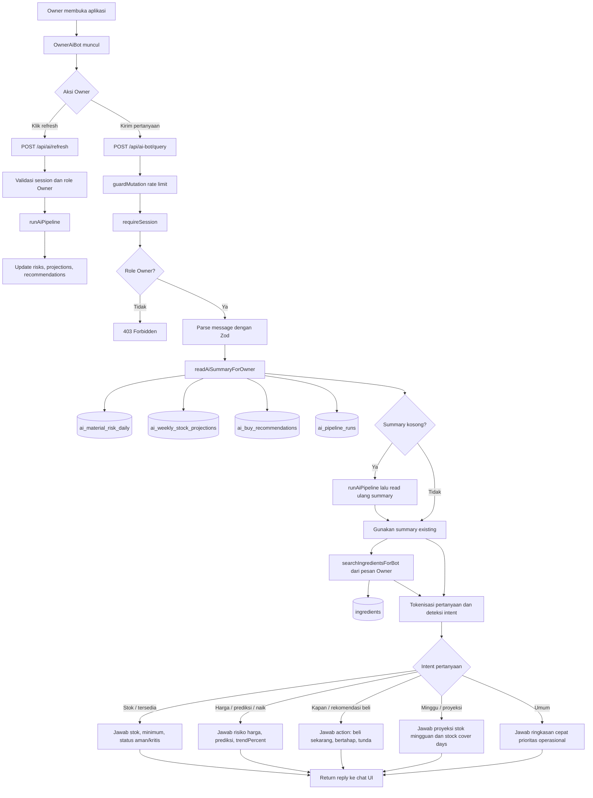

# SEGERSTOK Application Flowchart

Dokumen ini memetakan cara kerja aplikasi full-stack SEGERSTOK berdasarkan struktur kode saat ini: frontend Next.js, API routes, auth role, database PostgreSQL/Supabase via Drizzle, AI pipeline, dan Owner AI Bot.

## 1. Flow Utama Aplikasi

## 2. Flow Prediksi Harga dan AI Pipeline

## 3. Flow Owner AI Bot

## 4. Ringkasan Endpoint dan Tabel

| Area | Endpoint | Role | Tabel utama | Fungsi |
|---|---|---:|---|---|
| Auth | `/api/auth/[...all]` | Semua | `user`, `session`, `account`, `verification` | Login/session via Better Auth |
| Stok bahan | `GET /api/ingredients` | Semua login | `ingredients` | Ambil master bahan aktif |
| Master bahan | `POST/PATCH/PUT /api/ingredients` | Owner | `ingredients` | Tambah/edit bahan, kategori, unit |
| Transaksi stok | `POST /api/transactions` | Owner/Kasir/Cheef/Waiters | `stock_transactions`, `ingredients` | Catat stok masuk/keluar dan update stok |
| Batch transaksi | `POST /api/transactions/batch` | Owner/Kasir/Cheef/Waiters | `stock_transactions`, `ingredients` | Input banyak transaksi sekaligus |
| Riwayat transaksi | `GET /api/transactions` | Owner | `stock_transactions` | Audit transaksi |
| Opname | `POST /api/opname` | Owner/Kasir/Cheef/Waiters | `stock_opname`, `stock_opname_details` | Input aktual lapangan tanggal 30 |
| Laporan opname | `GET /api/opname` | Owner | `stock_opname` | Lihat laporan opname |
| Prediksi harga | `GET /api/price-predictions` | Owner | `ai_material_risk_daily`, fallback `price_predictions` | Tampilkan prediksi harga real dari AI |
| AI summary | `GET /api/ai/summary` | Owner | `ai_material_risk_daily`, `ai_weekly_stock_projections`, `ai_buy_recommendations`, `ai_pipeline_runs` | Ringkasan AI dashboard/bot |
| AI refresh | `GET/POST /api/ai/refresh` | Cron/Owner | Semua tabel AI | Jalankan pipeline AI |
| AI bot | `POST /api/ai-bot/query` | Owner | Tabel AI + `ingredients` | Jawab pertanyaan operasional Owner |
| Health check | `GET /api/health`, `GET /api/ai/health` | Publik/internal | DB + `ai_pipeline_runs` | Monitoring status aplikasi |

## 5. Catatan Teknis Penting

- AI Bot saat ini bekerja sebagai rule-based operational assistant: ia membaca database internal dan hasil pipeline AI, lalu menyusun jawaban berdasarkan intent pertanyaan.
- Data prediksi harga di halaman `Prediksi Kenaikan Harga` sekarang diprioritaskan dari `ai_material_risk_daily` terbaru. Jika tabel AI kosong, endpoint baru fallback ke `price_predictions` lama.
- Role staff hanya masuk ke workflow input operasional. Role Owner adalah satu-satunya role yang membaca dashboard, laporan, prediksi harga, dan AI Bot.
- `POST /api/transactions` dan `POST /api/transactions/batch` memakai transaksi database untuk menjaga konsistensi: insert transaksi dan update stok dilakukan dalam satu unit kerja.
- Opname dibatasi ke tanggal 30 zona waktu `Asia/Jakarta`, sehingga validasi waktu ada di backend, bukan hanya di UI.
