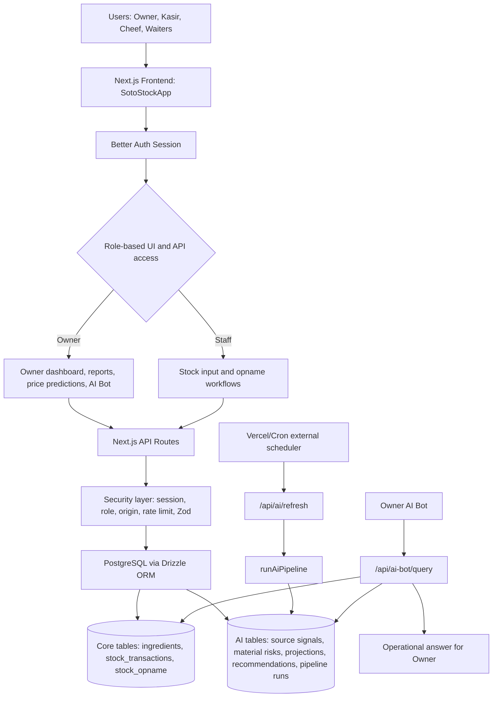
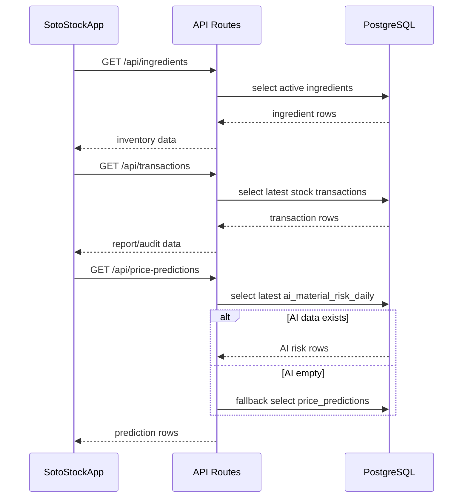
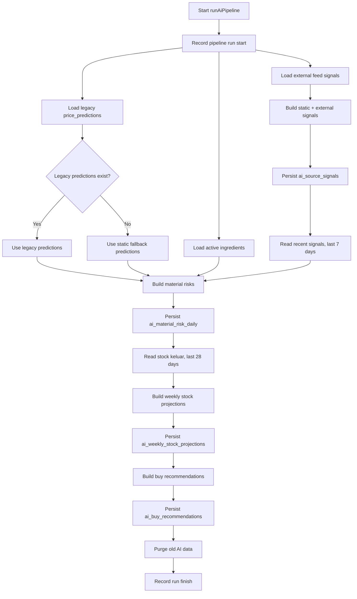
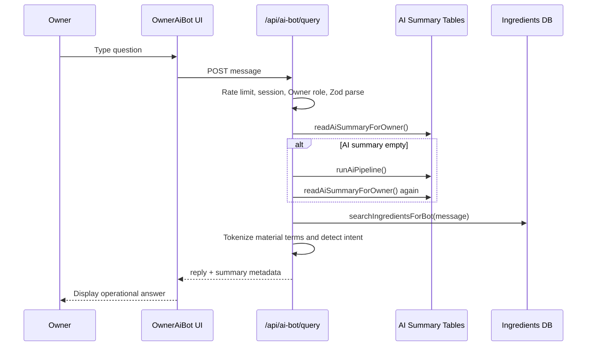
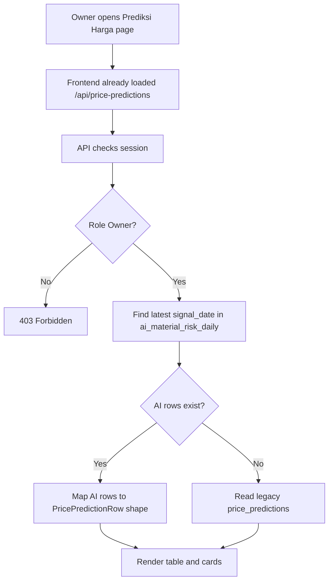
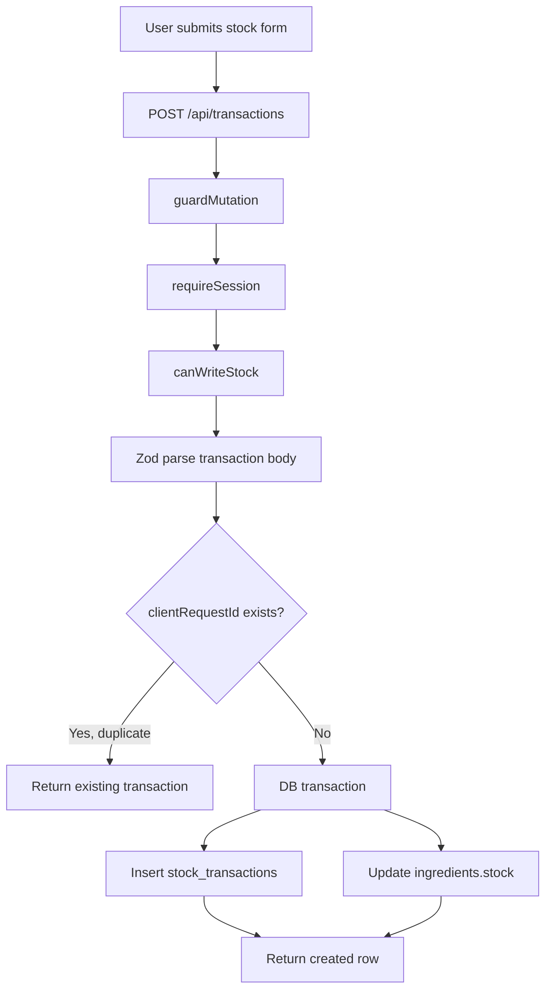
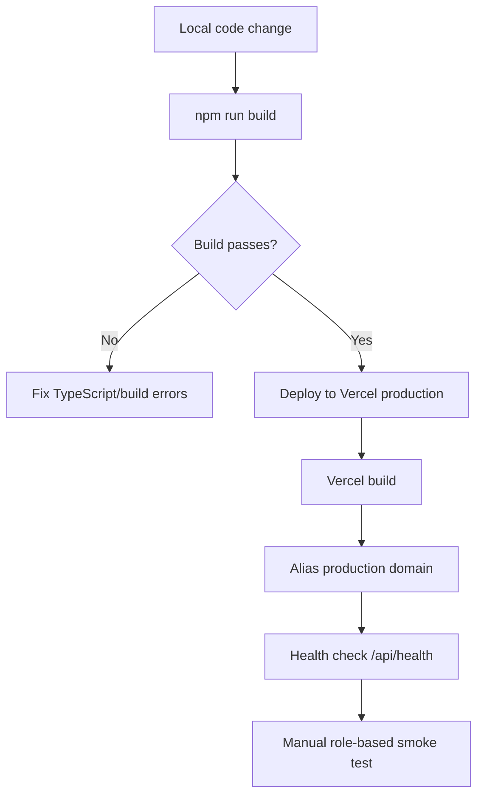

# PRD Summary Full-Stack Application

## SEGERSTOK / STOKARA - Inventory, Price Intelligence, and Owner AI Bot

| Field | Detail |
|---|---|
| Product | SEGERSTOK / STOKARA |
| Domain | Inventory operations for food/restaurant raw materials |
| Current stack | Next.js App Router, React, TypeScript, Tailwind CSS, Better Auth, Drizzle ORM, PostgreSQL/Supabase, Vercel |
| Primary user | Owner bisnis kuliner |
| Secondary users | Kasir, Cheef, Waiters |
| Core value | Kontrol stok, audit transaksi, prediksi kenaikan harga, rekomendasi beli, dan bantuan AI operasional |
| Document purpose | Template PRD dan architecture reference untuk membangun proyek full-stack serupa di masa depan |
| Status basis | Berdasarkan implementasi aktual di repo, bukan hanya rencana awal |

---

## 1. Executive Summary

SEGERSTOK adalah aplikasi full-stack untuk mengelola stok bahan baku restoran/UMKM kuliner dengan fokus pada akurasi operasional, auditability, dan pengambilan keputusan berbasis data. Aplikasi ini tidak hanya mencatat stok masuk/keluar, tetapi juga menggabungkan modul AI pipeline yang membaca sinyal harga, menghitung risiko kenaikan harga bahan, memproyeksikan kebutuhan stok mingguan, dan memberi rekomendasi pembelian kepada Owner.

Aplikasi ini dirancang dengan prinsip:

| Prinsip | Implementasi |
|---|---|
| Operational first | Form stok masuk/keluar dan opname dibuat sebagai workflow utama, bukan dekorasi dashboard |
| Owner visibility | Owner memiliki dashboard, laporan, prediksi harga, dan AI Bot |
| Staff simplicity | Staff hanya melihat workflow yang perlu mereka isi |
| Backend as source of truth | Semua validasi penting dilakukan di API, bukan hanya di UI |
| AI as decision support | AI membantu rekomendasi, bukan menggantikan keputusan Owner |
| Audit-ready | Transaksi stok, operator, tanggal, dan catatan disimpan sebagai histori |

Produk ini dapat dijadikan blueprint untuk aplikasi lain yang memiliki pola:

1. Master data bisnis
2. Transaksi operasional
3. Role-based access control
4. Analytical dashboard
5. AI pipeline berkala
6. AI assistant yang menjawab dari database internal

---

## 2. Problem Statement

UMKM kuliner sering memiliki masalah yang terlihat sederhana tetapi berdampak langsung ke margin:

| Masalah | Dampak |
|---|---|
| Stok masih dicatat manual | Data hilang, sulit diaudit, tidak realtime |
| Stok keluar tidak konsisten | Owner tidak tahu pemakaian bahan sebenarnya |
| Opname lambat dan rawan subjektif | Selisih stok sulit dipertanggungjawabkan |
| Harga bahan naik mendadak | Margin turun karena pembelian tidak antisipatif |
| Staff memiliki akses terlalu luas | Risiko manipulasi dan kesalahan input meningkat |
| Owner sulit membaca data mentah | Keputusan beli tidak berbasis prioritas |

SEGERSTOK menyelesaikan masalah ini dengan memisahkan workflow staff dan Owner, menjaga data operasional di PostgreSQL, dan menyediakan AI layer untuk mengubah data mentah menjadi rekomendasi.

---

## 3. Product Goals

| Goal | Target Behavior | Ukuran Keberhasilan |
|---|---|---|
| Stok realtime | Setiap transaksi langsung mengubah stok bahan | Selisih UI dan DB = 0 setelah transaksi sukses |
| Audit transaksi | Semua stok masuk/keluar memiliki operator dan timestamp | 100% transaksi punya `operatorName`, `transactionDate`, `type` |
| Role clarity | Staff tidak dapat membaca data Owner-only | Endpoint Owner-only return 403 untuk role non-Owner |
| Prediksi harga tidak kosong | Halaman prediksi membaca AI daily risk terbaru | Jika `ai_material_risk_daily` ada, UI menampilkan data AI |
| AI actionable | Owner bisa bertanya stok, risiko harga, dan rekomendasi beli | AI Bot menjawab berdasarkan DB internal |
| Deployment repeatable | App bisa build dan deploy di Vercel | `npm run build` sukses dan alias production aktif |

---

## 4. Non-Goals

| Non-Goal | Alasan |
|---|---|
| AI generatif bebas tanpa kontrol data | Risiko halusinasi; aplikasi ini harus audit-ready |
| Staff melihat semua laporan Owner | Tidak sesuai prinsip least privilege |
| UI marketing landing page sebagai halaman utama | Produk ini adalah aplikasi operasional, bukan website promosi |
| Menghitung stok final di frontend | Frontend mudah dimanipulasi; stok final harus dari backend/database |
| Menyimpan secret di client | Semua secret harus hanya tersedia di server/Vercel environment |

---

## 5. User Roles and Access Model

### 5.1 Role Matrix

| Role | Akses UI | Read Data | Write Data | AI Access |
|---|---|---|---|---|
| Owner | Semua menu | Semua data operasional dan AI | Master bahan, stok, opname, refresh AI | Ya |
| Kasir | Stok masuk, stok keluar, opname | Master bahan aktif | Transaksi stok, opname | Tidak |
| Cheef | Stok masuk, stok keluar, opname | Master bahan aktif | Transaksi stok, opname | Tidak |
| Waiters | Stok masuk, stok keluar, opname | Master bahan aktif | Transaksi stok, opname | Tidak |

### 5.2 Authorization Rules

| Function | Rule |
|---|---|
| `canWriteStock(role)` | Owner, Kasir, Cheef, Waiters |
| `canWriteActual(role)` | Owner, Kasir, Cheef, Waiters |
| Owner reports | Owner only |
| AI summary | Owner only |
| AI Bot | Owner only |
| Master data mutation | Owner only |
| Public signup Owner | Blocked; signup Owner otomatis diturunkan menjadi Kasir |

### 5.3 Important Security Behavior

Better Auth menyimpan role di tabel `user.role`. Pada signup publik, role `Owner` tidak dapat dibuat langsung dari client. Jika user mencoba signup sebagai Owner, hook backend mengubah role menjadi `Kasir`. Ini penting untuk mencegah privilege escalation.

---

## 6. Current Technology Stack

| Layer | Technology | Role |
|---|---|---|
| Frontend | Next.js App Router + React | Rendering halaman dan client interactions |
| Language | TypeScript | Type safety end-to-end |
| Styling | Tailwind CSS + CSS variables | Theme, layout, responsive UI |
| Icons | Lucide React | Operational UI icons |
| Auth | Better Auth | Session, email/password auth, user role |
| ORM | Drizzle ORM | Type-safe database query |
| Database | PostgreSQL/Supabase | Source of truth |
| Hosting | Vercel | Production deployment |
| AI logic | Internal TypeScript pipeline | Scoring, projections, recommendations |
| Validation | Zod | Request body validation |
| Security guards | Same-origin guard, rate limit, payload limit | Mutation safety |

---

## 7. High-Level Architecture



---

## 8. Frontend Architecture

### 8.1 Main Component

Main client surface berada di `SotoStockApp`.

Responsibilities:

| Area | Detail |
|---|---|
| Session state | Membaca session Better Auth |
| Role detection | Default role fallback ke `Kasir` jika role kosong |
| Navigation | Owner melihat semua menu; staff hanya workflow input |
| Data loading | Memanggil API `ingredients`, `transactions`, `price-predictions` |
| UI state | Active page, theme, layout mode, search/filter, toast |
| Forms | Stok masuk, stok keluar, batch transaction, opname, master bahan |
| AI Bot mount | `OwnerAiBot` hanya dirender untuk Owner |

### 8.2 Navigation Model

| Page ID | Label | Owner | Staff | Purpose |
|---|---|---:|---:|---|
| `dashboard` | Dashboard | Ya | Tidak | Overview stok, metrics, AI highlights |
| `stok` | Stock | Ya | Tidak | Monitoring bahan dan status stok |
| `stok-masuk` | Stock Masuk | Ya | Ya | Input bahan masuk |
| `stok-keluar` | Stock Keluar | Ya | Ya | Input bahan keluar |
| `opname` | Opname | Ya | Ya | Input data aktual lapangan |
| `ai` | Prediksi Harga | Ya | Tidak | Prediksi kenaikan harga bahan |
| `laporan` | Laporan | Ya | Tidak | Histori transaksi dan audit |
| `supplier` | Supplier | Ya | Tidak | Placeholder/roadmap supplier |
| `bahan` | Master Bahan | Ya | Tidak | CRUD bahan, kategori, unit |
| `pengaturan` | Pengaturan | Ya | Tidak | Akun, role, session |

### 8.3 Frontend Data Loading

Owner initial load:



Staff initial load:

| Step | Behavior |
|---|---|
| 1 | Auth session valid |
| 2 | Load `GET /api/ingredients` |
| 3 | Render only stock input and opname pages |
| 4 | Do not load Owner-only transactions or AI predictions |

---

## 9. Backend API Architecture

### 9.1 API Principles

| Principle | Implementation |
|---|---|
| Session required by default | All operational routes call `requireSession()` |
| Role enforced server-side | UI hiding is not treated as security |
| Zod request validation | Mutation payloads parsed with schema |
| Rate limit mutation routes | `guardMutation` per IP/path |
| Same-origin guard | Cross-origin mutation rejected |
| Payload size control | `parseJsonBody` rejects oversized payload |
| Database transaction for stock updates | Insert transaction and update stock are atomic |

### 9.2 Endpoint Summary

| Endpoint | Method | Role | Primary Tables | Purpose |
|---|---|---|---|---|
| `/api/health` | GET | Public/internal | DB ping | App/database health |
| `/api/auth/[...all]` | GET/POST | Public/session | `user`, `session`, `account`, `verification` | Better Auth |
| `/api/ingredients` | GET | Logged in | `ingredients` | Read active/search ingredients |
| `/api/ingredients` | POST | Owner | `ingredients` | Create ingredient |
| `/api/ingredients` | PATCH | Owner | `ingredients` | Edit ingredient |
| `/api/ingredients` | PUT | Owner | `ingredients` | Rename category/unit in ingredients |
| `/api/ingredients/master` | GET | Logged in | `ingredient_master_options`, `ingredients` | Read unit/category options |
| `/api/ingredients/master` | POST | Owner | `ingredient_master_options` | Add option |
| `/api/ingredients/master` | PATCH | Owner | `ingredient_master_options`, `ingredients` | Rename option and affected ingredients |
| `/api/ingredients/master` | DELETE | Owner | `ingredient_master_options` | Soft deactivate option |
| `/api/transactions` | GET | Owner | `stock_transactions` | Read transaction history |
| `/api/transactions` | POST | Owner/staff | `stock_transactions`, `ingredients` | Insert one stock transaction |
| `/api/transactions/batch` | POST | Owner/staff | `stock_transactions`, `ingredients` | Insert multi-row transactions |
| `/api/opname` | GET | Owner | `stock_opname` | Read opname reports |
| `/api/opname` | POST | Owner/staff | `stock_opname`, `stock_opname_details` | Submit actual stock |
| `/api/price-predictions` | GET | Owner | `ai_material_risk_daily`, `price_predictions` | Serve price prediction page |
| `/api/price-predictions` | POST | Owner | `price_predictions` | Legacy/manual prediction insert |
| `/api/ai/summary` | GET | Owner | AI tables | Read AI summary, auto-run if daily risk empty |
| `/api/ai/refresh` | GET | Cron secret | AI tables | Scheduled AI refresh |
| `/api/ai/refresh` | POST | Owner | AI tables | Manual AI refresh |
| `/api/ai/health` | GET | Public/internal | `ai_pipeline_runs` | AI monitoring |
| `/api/ai-bot/query` | POST | Owner | AI tables + `ingredients` | Owner AI Bot question answering |
| `/api/admin/apply-ai-migration` | POST | Bearer secret + production | AI schema | Production AI migration fallback |

---

## 10. Database Architecture

### 10.1 Table Groups

| Group | Tables |
|---|---|
| Auth | `user`, `session`, `account`, `verification` |
| Master data | `ingredients`, `ingredient_master_options` |
| Operations | `stock_transactions`, `stock_opname`, `stock_opname_details` |
| Legacy prediction | `price_predictions` |
| AI intelligence | `ai_source_signals`, `ai_material_risk_daily`, `ai_weekly_stock_projections`, `ai_buy_recommendations`, `ai_pipeline_runs` |

### 10.2 Core Tables

#### `ingredients`

| Column | Type | Purpose |
|---|---|---|
| `id` | text PK | Stable identifier |
| `name` | varchar(160), unique | Nama bahan |
| `category` | varchar(160) | Kategori dinamis |
| `unit` | varchar(32) | Satuan stok |
| `stock` | numeric(12,2) | Stok saat ini |
| `minimum_stock` | numeric(12,2) | Ambang minimum |
| `average_price` | integer | Harga rata-rata Rupiah |
| `active` | boolean | Soft availability |
| `created_at`, `updated_at` | timestamptz | Audit metadata |

Important indexes:

| Index | Purpose |
|---|---|
| `ingredients_name_idx` | Prevent duplicate ingredient names |
| `ingredients_category_idx` | Fast category grouping/filter |

#### `stock_transactions`

| Column | Purpose |
|---|---|
| `ingredient_id` | FK to `ingredients` |
| `type` | `masuk` or `keluar` |
| `quantity` | Decimal quantity |
| `unit_price` | Rupiah price for inbound transaction |
| `transaction_date` | Operational date |
| `client_request_id` | Idempotency key |
| `operator_id`, `operator_name` | Actor audit |
| `note` | Optional operational note |

Stock mutation rule:

| Type | Stock update |
|---|---|
| `masuk` | `ingredients.stock + quantity` |
| `keluar` | `greatest(ingredients.stock - quantity, 0)` |

The `keluar` rule prevents negative stock. This is operationally safe, but finance/audit may also need a variance report for attempted over-consumption.

#### `stock_opname` and `stock_opname_details`

Opname is a controlled reconciliation workflow. Current implementation permits submit only on day `30` in timezone `Asia/Jakarta`.

Final actual formula:

```text
finalActual = average(cashierActual, chefActual, waitersActual)
variance = systemStock - finalActual
```

Mathematical check:

| Case | Result |
|---|---|
| No staff actual value | `finalActual = null`, `variance = null` |
| 1 role inputs actual | Average of 1 value |
| 2 roles input actual | Average of 2 values |
| 3 roles input actual | Average of 3 values |

### 10.3 AI Tables

#### `ai_source_signals`

Stores raw/normalized market/news/government signals.

| Column | Purpose |
|---|---|
| `source_type` | Type of source |
| `source_name` | Human-readable source |
| `source_url` | Source link |
| `headline` | Signal title |
| `summary` | Extracted summary |
| `commodity_tags` | Material keywords |
| `signal_score` | Signal strength |
| `published_at` | Source publish time |
| `content_hash` | Deduplication key |

#### `ai_material_risk_daily`

Primary table for price prediction page.

| Column | Purpose |
|---|---|
| `item_name` | Commodity/material name |
| `signal_date` | Daily risk date |
| `risk_score` | 0-100 risk score |
| `risk` | `Rendah`, `Sedang`, `Tinggi` |
| `trend_percent` | Estimated price movement |
| `current_price` | Current reference price |
| `predicted_price` | Predicted next/reference price |
| `source_count` | Number of matching signals |
| `reason` | Human-readable explanation |

Important rule:

```text
GET /api/price-predictions
  -> read latest ai_material_risk_daily signal_date
  -> if rows exist, return AI rows
  -> if no AI rows, fallback to price_predictions legacy
```

#### `ai_weekly_stock_projections`

Forecasts short-term stock coverage.

| Column | Purpose |
|---|---|
| `week_start`, `week_end` | Projection window |
| `current_stock` | Current stock at run time |
| `predicted_weekly_usage` | Expected usage |
| `predicted_ending_stock` | Current minus expected usage |
| `stock_cover_days` | Estimated days of stock coverage |
| `risk_boost_percent` | Demand/procurement risk adjustment |

#### `ai_buy_recommendations`

Decision output for purchasing.

| Column | Purpose |
|---|---|
| `action` | `beli-sekarang`, `beli-bertahap`, `tunda-beli` |
| `recommended_quantity` | Suggested quantity |
| `priority_score` | Purchase urgency score |
| `explanation` | Reason for recommendation |

#### `ai_pipeline_runs`

Observability table for AI pipeline.

| Column | Purpose |
|---|---|
| `run_type` | Example: `full-refresh` |
| `status` | `success`, `partial`, `failed` |
| `started_at`, `finished_at` | Runtime tracking |
| `metrics_json` | Counts: ingested signals, generated risks, purged rows |
| `error_message` | Failure detail |

---

## 11. AI Pipeline PRD

### 11.1 Purpose

The AI pipeline converts market signals and internal inventory data into daily operational recommendations.

### 11.2 Trigger Sources

| Trigger | Endpoint | Actor |
|---|---|---|
| Scheduled refresh | `GET /api/ai/refresh` | Cron with `Authorization: Bearer <CRON_SECRET>` |
| Manual refresh | `POST /api/ai/refresh` | Owner |
| Empty AI summary | `GET /api/ai/summary` | Owner request |
| Empty bot context | `POST /api/ai-bot/query` | Owner AI Bot |

### 11.3 Pipeline Flow



### 11.4 Material Risk Logic

Inputs:

| Input | Source |
|---|---|
| Ingredients | `ingredients` |
| Baseline price predictions | `price_predictions` or static fallback |
| Recent signals | `ai_source_signals` last 7 days |
| Current date key | Asia/Jakarta date key |

Output:

| Output | Meaning |
|---|---|
| `riskScore` | Combined score from price trend and signal average |
| `risk` | Human bucket: Rendah/Sedang/Tinggi |
| `trendPercent` | Price change percent |
| `sourceCount` | Signal match count |
| `reason` | Explanation for Owner |

### 11.5 Reliability Expectations

| Scenario | Expected Behavior |
|---|---|
| External feed fails partially | Pipeline status becomes `partial`, internal/static data still used |
| Legacy predictions empty | Static fallback predictions used |
| Same item/date exists | Upsert updates existing AI row |
| Old AI rows exist | Purge by retention policy |
| Pipeline fails | `ai_pipeline_runs.status = failed` and `error_message` stored |

---

## 12. Owner AI Bot PRD

### 12.1 Product Purpose

Owner AI Bot is not a generic chatbot. It is an operational assistant that answers questions using internal database and AI pipeline output.

It should help Owner answer:

| Question Type | Example |
|---|---|
| Stock availability | "Sisa cabai berapa?" |
| Price prediction | "Cabai rawit bakal naik?" |
| Buy timing | "Kapan sebaiknya beli minyak?" |
| Weekly projection | "Stok ayam cukup sampai minggu depan?" |
| Summary | "Apa prioritas beli hari ini?" |

### 12.2 Bot Flow



### 12.3 Bot Intent Categories

| Intent | Detection Keywords | Data Used | Answer Style |
|---|---|---|---|
| Stock | `sisa`, `stok`, `stock`, `tersedia` | `ingredients` | Quantity, unit, minimum, status |
| Price | `harga`, `prediksi`, `naik`, `turun`, `besok` | `ai_material_risk_daily` | Current price, predicted price, risk, trend |
| Buy timing | `kapan`, `waktu`, `rekomendasi`, `beli` | `ai_buy_recommendations` | Buy now/gradual/delay, quantity, priority |
| Projection | `minggu`, `proyeksi`, `habis`, `cukup` | `ai_weekly_stock_projections` | Weekly usage, ending stock, cover days |
| General | No exact intent | AI summary | Operational summary |

### 12.4 Bot Constraints

| Constraint | Reason |
|---|---|
| Owner only | Bot exposes sensitive operations and purchase strategy |
| No free hallucination | Must answer from DB and pipeline summary |
| Must state data basis | Reply includes `database internal + pipeline AI per <date>` |
| Does not use active page context yet | Current payload does not pass active page from UI |
| Excludes staff workflow | Bot response metadata excludes stok masuk, stok keluar, data aktual lapangan |

---

## 13. Price Prediction Feature PRD

### 13.1 Objective

Halaman `Prediksi Kenaikan Harga` harus selalu menampilkan data jika sumber AI tersedia. Empty state hanya boleh muncul jika:

1. User bukan Owner, atau
2. Session invalid, atau
3. `ai_material_risk_daily` kosong dan `price_predictions` legacy juga kosong, atau
4. API/database error.

### 13.2 Current Flow



### 13.3 UI Contract

Frontend expects:

| Field | Type | Meaning |
|---|---|---|
| `id` | string | Row ID |
| `itemName` | string | Material/commodity name |
| `currentPrice` | number | Current price in Rupiah |
| `predictedPrice` | number | Forecast/reference price in Rupiah |
| `changePercent` | string/numeric | Percent change |
| `risk` | enum | Rendah/Sedang/Tinggi |
| `sourceName` | string | AI/legacy source label |
| `sourceUrl` | string | Link target |
| `summary` | string | Human explanation |
| `publishedAt` | date/null | Source/run date |

---

## 14. Operational Workflows

### 14.1 Single Stock Transaction



### 14.2 Batch Transaction

Batch flow supports up to 20 rows. Each row receives deterministic `clientRequestId`:

```text
clientRequestId = clientBatchId:index:ingredientId
```

This protects against duplicate submissions when network retry happens.

### 14.3 Opname

Backend rule:

```text
Only allowed when current date in Asia/Jakarta is day 30
AND submitted opnameDate is also day 30
```

This prevents staff from submitting actual stock outside the approved monthly timing.

---

## 15. Security and Data Integrity Requirements

### 15.1 Authentication

| Requirement | Implementation |
|---|---|
| Session storage | Better Auth sessions |
| Email/password | Enabled |
| Email verification | Disabled for current product simplicity |
| Role field | Stored in `user.role` |
| Owner signup block | Public signup Owner downgraded to Kasir |

### 15.2 Authorization

Authorization must always be enforced in API routes. Frontend menu filtering is UX only.

| Data/Action | Required Role |
|---|---|
| Read ingredients | Any logged-in role |
| Create/edit ingredients | Owner |
| Read transactions | Owner |
| Write transactions | Owner, Kasir, Cheef, Waiters |
| Submit opname | Owner, Kasir, Cheef, Waiters |
| Read opname reports | Owner |
| Read AI | Owner |
| Refresh AI manually | Owner |
| Cron AI refresh | Bearer `CRON_SECRET` |

### 15.3 Mutation Guard

| Guard | Purpose |
|---|---|
| Same-origin guard | Reject cross-origin mutation |
| Rate limit | Prevent spam/replay from one IP |
| Payload limit | Prevent large body abuse |
| Zod validation | Reject invalid shape/type |
| DB transaction | Keep stock and transaction logs consistent |

### 15.4 Consistency Rules

| Rule | Reason |
|---|---|
| Never update stock without stock transaction | Audit trail would break |
| Never trust frontend stock calculation | Client can be stale or manipulated |
| Always use idempotency key for batch writes | Prevent duplicate stock movement |
| Keep `stock >= 0` | Avoid impossible operational state |
| Use unique index for daily AI material risk | One item per date should have one active risk row |

---

## 16. UX and Visual Design Requirements

### 16.1 Current Visual Direction

Current product direction is not generic SaaS blue/purple. It uses a culinary-operational identity:

| Element | Direction |
|---|---|
| Display font | Playfair Display |
| Sans font | DM Sans |
| Mono font | DM Mono |
| Palette | Warm ink, gold, muted culinary paper tones, night mode |
| Interaction | Dense operational dashboard, not landing-page marketing |
| Motion | Subtle elegant-in transitions and restrained hover feedback |

### 16.2 Mandatory Anti-Generic Design Rule

For this product and future similar projects:

> NEVER use generic AI-generated aesthetics like overused font families (Inter, Roboto, Arial, system fonts), cliched color schemes, especially purple gradients on white backgrounds, predictable layouts and component patterns, or cookie-cutter design that lacks context-specific character.

Implementation requirements:

| Rule | Practical Meaning |
|---|---|
| Avoid overused fonts | Do not default to Inter, Roboto, Arial, or generic system stacks as the primary identity |
| Avoid cliche palettes | No purple-blue gradient hero cards unless the brand context explicitly demands it |
| Avoid predictable layouts | Do not default to generic sidebar + cards without domain-specific hierarchy |
| Design for context | Culinary inventory should feel operational, warm, audit-ready, and tactile |
| Vary aesthetics per project | A clinic, fintech, restaurant, legal office, and game should not share the same visual DNA |
| Complexity must match vision | Maximalist design requires detailed animation/effects; refined design requires spacing/typography precision |

### 16.3 Aesthetic Decision Framework

When building another full-stack app, choose an aesthetic from the domain:

| Domain | Possible Direction | Avoid |
|---|---|---|
| Culinary operations | Ledger, kitchen prep, market price board, warm inventory desk | Generic SaaS purple cards |
| Finance/audit | High-density ledger, calm contrast, exact numerics, tabular hierarchy | Decorative gradients |
| Healthcare | Clinical calm, strong information safety, accessible contrast | Playful dashboards |
| Construction/logistics | Field ops, maps, rugged controls, status bands | Minimalist empty white UI |
| Education | Learning pathway, modular content, readable long-form | Enterprise admin sameness |

### 16.4 UI Density Rule

SEGERSTOK is an operational tool. It should prioritize:

1. Fast scanning
2. Clear numbers
3. Dense tables where useful
4. Minimal decorative cards
5. Strong error states
6. Mobile-friendly input workflows

It should not behave like a marketing landing page.

---

## 17. Non-Functional Requirements

### 17.1 Performance

| Metric | Target |
|---|---|
| App build | Must pass `npm run build` |
| API read | Common reads should return within 500-1,500 ms depending on Supabase latency |
| Mutation | Single stock mutation should complete in one database transaction |
| AI summary | Should read cached/persisted AI tables, not recompute unless empty |
| UI responsiveness | Form input must not wait for unrelated dashboard queries |

### 17.2 Reliability

| Scenario | Expected Behavior |
|---|---|
| Duplicate stock submit | Idempotency returns existing transaction when key matches |
| External AI feed down | Pipeline can still use static/internal fallback |
| User not Owner opens AI route | 403, no partial data leak |
| Supabase slow | Health check exposes latency |
| AI table empty | Summary/AI bot can trigger pipeline |

### 17.3 Scalability

| Area | Current Design | Future Scaling Path |
|---|---|---|
| API routes | Serverless Next.js handlers | Split heavy jobs to queue/worker if needed |
| DB connections | Postgres client max 10 | Use Supabase pooler and tune limits |
| AI pipeline | Runs in API route | Move to scheduled worker if runtime grows |
| Rate limit | In-memory map | Move to Redis/Upstash for multi-instance accuracy |
| Analytics | SQL queries | Add materialized views for high data volume |

### 17.4 Observability

| Signal | Current/Future |
|---|---|
| `/api/health` | DB status and latency |
| `/api/ai/health` | Latest AI run status |
| `ai_pipeline_runs` | AI run metrics and errors |
| Vercel logs | Serverless runtime logs |
| Future | Error tracking, structured logs, audit event table |

---

## 18. Deployment and Environment PRD

### 18.1 Environment Variables

| Variable | Required | Purpose |
|---|---:|---|
| `DATABASE_URL` | Yes | PostgreSQL/Supabase connection |
| `BETTER_AUTH_SECRET` | Yes | Auth signing/encryption secret |
| `BETTER_AUTH_URL` | Yes | Server auth base URL |
| `NEXT_PUBLIC_BETTER_AUTH_URL` | Yes | Client auth URL |
| `CRON_SECRET` | Production recommended | Secure AI refresh cron |
| `AI_NEWS_FEED_URLS` | Optional | External source feed URLs |

### 18.2 Deployment Flow



### 18.3 Production Smoke Test Checklist

| Check | Expected |
|---|---|
| Open `/api/health` | `status = ok`, `database = postgres` |
| Login Owner | Dashboard loads |
| Open Prediksi Harga | AI rows appear if `ai_material_risk_daily` has data |
| Login staff | Owner menu hidden |
| Submit stock test | Transaction created and stock updates |
| AI Bot ask "prioritas beli hari ini?" | Bot returns AI-based summary |

---

## 19. Reusable Blueprint for Similar Projects

Use this structure when building a similar full-stack app:

### 19.1 Domain Model Template

| Layer | Generic Concept | SEGERSTOK Example |
|---|---|---|
| Master data | Entity catalog | Ingredients |
| Transaction | Movement/event | Stock transactions |
| Reconciliation | Periodic actual check | Stock opname |
| Analytics | Derived summary | Stock status, reports |
| AI signal | External/internal input | Source signals |
| AI output | Decision support | Risks, projections, recommendations |
| Assistant | Natural language interface | Owner AI Bot |

### 19.2 Architecture Template

```text
Frontend UI
  -> Auth/session
  -> Role-filtered navigation
  -> API client wrapper
  -> Feature pages

Backend API
  -> Session guard
  -> Role guard
  -> Mutation guard
  -> Zod validation
  -> Database transaction
  -> Response envelope

Database
  -> Auth tables
  -> Master data
  -> Transaction logs
  -> Reconciliation tables
  -> AI input/output tables

AI Layer
  -> Scheduled ingestion
  -> Scoring/forecasting logic
  -> Persisted outputs
  -> Summary endpoint
  -> Bot endpoint
```

### 19.3 Recommended Build Order

| Phase | Build |
|---|---|
| 1 | Database schema and migrations |
| 2 | Auth and role model |
| 3 | Master data CRUD |
| 4 | Core transaction workflow |
| 5 | Audit/report view |
| 6 | Reconciliation workflow |
| 7 | AI tables and pipeline |
| 8 | AI summary endpoint |
| 9 | AI Bot |
| 10 | Monitoring, cron, production hardening |

---

## 20. Risks and Edge Cases

| Risk | Current Mitigation | Recommended Next Step |
|---|---|---|
| In-memory rate limit resets per serverless instance | Basic protection exists | Move to Redis for production-grade rate limiting |
| Stock keluar clamps to 0 | Prevents negative stock | Add attempted-overdraw audit warning |
| AI feed may fail | Partial status and fallback | Add alert when failed feeds exceed threshold |
| Owner account provisioning | Public Owner signup blocked | Add admin-only Owner bootstrap script/SOP |
| Opname only day 30 | Backend enforced | Add Owner override if business needs emergency opname |
| AI Bot does not use active page context | It states limitation | Pass `activePage` from UI in request payload |
| Supplier module incomplete | Placeholder UI exists | Create supplier schema and purchase order workflow |
| Production migration endpoint risk | Secret protected | Prefer normal migrations; keep endpoint disabled unless needed |

---

## 21. Acceptance Criteria

### 21.1 Core App

| Criteria | Pass Condition |
|---|---|
| Owner login | Owner sees all menu items |
| Staff login | Staff only sees stok masuk, stok keluar, opname |
| Ingredient read | Logged-in user gets active ingredients |
| Stock masuk | Quantity increases ingredient stock |
| Stock keluar | Quantity decreases ingredient stock but never below 0 |
| Batch submit retry | Duplicate request does not double-count stock |
| Transaction report | Owner can read latest transaction history |

### 21.2 AI

| Criteria | Pass Condition |
|---|---|
| Manual AI refresh | Owner can run `/api/ai/refresh` via UI button |
| Cron AI refresh | Bearer `CRON_SECRET` can trigger refresh |
| Price prediction page | Reads latest `ai_material_risk_daily` before legacy fallback |
| AI summary | Returns risks, projections, recommendations, latest run |
| AI health | Returns latest AI run status |

### 21.3 AI Bot

| Criteria | Pass Condition |
|---|---|
| Owner only | Non-Owner receives 403 |
| Stock question | Bot includes stock, unit, minimum, status |
| Price question | Bot includes current price, predicted price, risk, trend |
| Buy question | Bot includes action, quantity, priority |
| Empty AI context | Bot triggers pipeline, then answers from refreshed summary |

---

## 22. Future Roadmap

| Priority | Feature | Rationale |
|---|---|---|
| P0 | Production-grade rate limiting with Redis | Serverless-safe protection |
| P0 | Owner bootstrap/admin SOP | Prevent manual DB role changes |
| P1 | Supplier database and purchase order | Close procurement loop |
| P1 | Purchase price history by supplier | Better margin analysis |
| P1 | Food waste and variance report | Finance/audit value |
| P2 | WhatsApp notification | Operational reminders |
| P2 | AI anomaly detection | Detect abnormal stock usage |
| P2 | Active page context for AI Bot | More contextual answers |
| P3 | Offline queue/PWA sync | Improve unstable network workflow |

---

## 23. Definition of Done for Similar Future Apps

A similar project should not be considered complete unless:

1. Database schema has clear primary keys, foreign keys, indexes, and retention logic where needed.
2. Role-based access is enforced server-side.
3. Every mutation validates payload with schema.
4. Critical state changes use database transactions.
5. Frontend state is refreshed after mutation success.
6. Empty states distinguish between "no data", "no permission", and "error".
7. AI outputs are persisted before being served to the UI.
8. AI assistant answers from internal data, not generic assumptions.
9. Production deploy has health check and smoke test.
10. Visual design has domain-specific character and does not fall into generic AI aesthetic defaults.

---

## 24. One-Page Architecture Summary

```text
SEGERSTOK

User
  -> Next.js UI
  -> Better Auth session
  -> Role-gated navigation

Frontend
  -> apiJson wrapper
  -> Feature pages
  -> OwnerAiBot

Backend
  -> API route handlers
  -> requireSession
  -> getRole/canWrite guards
  -> guardMutation
  -> Zod validation
  -> Drizzle ORM

Database
  -> Auth tables
  -> Ingredients
  -> Stock transactions
  -> Opname
  -> AI signals
  -> AI risks
  -> AI projections
  -> AI buy recommendations
  -> AI run logs

AI
  -> Refresh trigger
  -> Signal ingestion
  -> Risk scoring
  -> Weekly stock projection
  -> Buy recommendation
  -> Summary endpoint
  -> Owner AI Bot

Deployment
  -> Vercel
  -> Supabase/PostgreSQL
  -> Cron secret
  -> Health checks
```

This document is intended to be reused as a baseline PRD and architecture reference for future full-stack operational applications.
